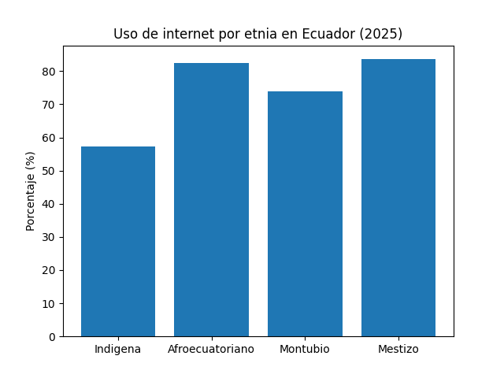

# Brecha digital en Ecuador

Análisis exploratorio de la brecha digital urbano-rural y étnica en Ecuador,
usando datos oficiales del INEC (encuesta ENEMDU-TIC, 2022-2025).

Herramientas: Python, pandas, Google Colab.

Ver el informe completo: [informe_brecha_digital_ecuador.md](informe_brecha_digital_ecuador.md)

